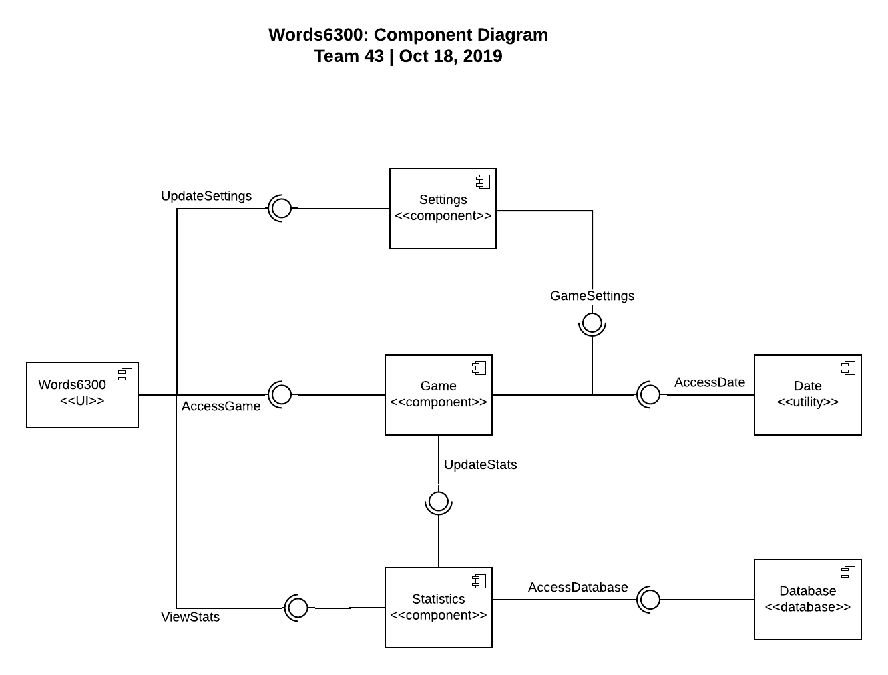
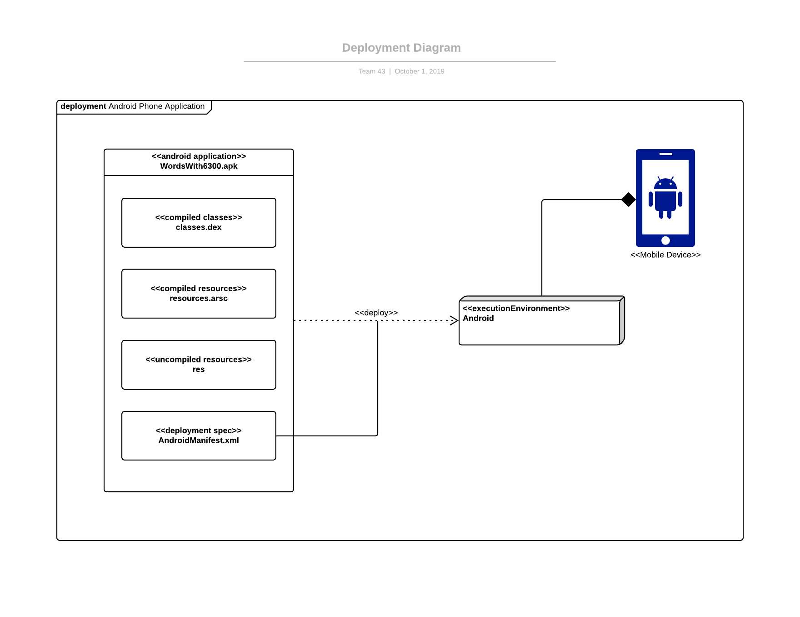
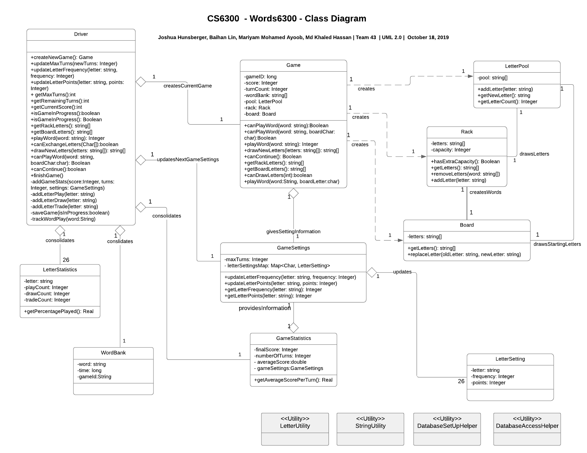

# Design Document

**Author**: Team 43

## 1 Design Considerations

### 1.1 Assumptions

1. The app will be designed with Android Studio.
2. The players will be using a phone or tablet that runs Android OS.
3. The phone will have hardware specifications enough to run the app without any interference.

### 1.2 Constraints

1. The app will not save any player information since its not a requirement.
2. An user can not quit a game while in progress to start a new one.
3. All 26 alphabets must be present in any settings of the letter pool.
4. The letter points and distribution assigned to each letter must be greater than 0.
5. The maximum number of turns allowed in a game must be assigned to a number greater than 0.

### 1.3 System Environment

1. Preferably the latest version of Android OS
2. The phone will have enough RAM, precessing speed, and storage space to run the app smoothly and save the game statistics.

## 2 Architectural Design

### 2.1 Component Diagram

1. The system will have one user interface component, namely 'Scrabble App' to provide the user an interface to perform the major functionalities.
2. The app will have three major components: 1) Settings, 2) Game, 3) Statistics, all of which provides interfaces to the 'Scrabble App' component through various methods implemented inside these components.
3. There are two major utility components namely 'Date' and 'Database' that provide required services to the major components.
4. The 'Settings' component provides 'GameSettings' interface to the 'Game' component to update the game settings, such as letter pool settings, maximum number of turns, etc. The 'UpdateStats' is another interface provided by the 'Game' component in order to save the data after each of the game is completed.

### 2.2 Deployment Diagram

All components  of the app will be deployed on a single smart phone.

## 3 Low-Level Design

### 3.1 Class Diagram

The class diagram is described in detail in our project deliverable 1.

### 3.2 Other Diagrams

At this point, we believe no other diagram is necessary to describe this project.

## 4 User Interface Design
We have included a representation of the app's screens in this section. Although, we strive to keep the UI design of the application similar to the mock-ups, the final design may vary based on the implementation. 

