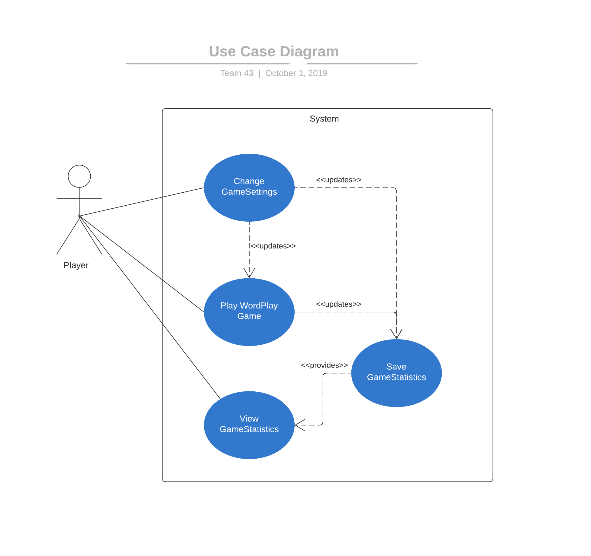

# Use Case Model

**Author**: Team 43

## 1 Use Case Diagram

## 2 Use Case Descriptions

### Use Case 1: Play WordPlay Game

- **Requirements**: The user should be able to play the wordPlay game.  
- **Pre-conditions:**  The game settings should be properly set. The user should be able to start a game when choosing to "play game" in the main menu.  
- **Post-conditions:**  The user should be able to access the game interface once chosen the "play game" option (for more details, please refer to the mockup of the graphical interface in the DesignDocument.md). The game should automatically updates the statistics in the system.
- **Scenarios:** The user should be able to see the game interface and interact with the system. The statistics should be correctly updated after the user's actions.

### Use Case 2: Change GameSettings

- **Requirements:**  The user should be able to change the game settings.  

- **Pre-conditions:**  The default game settings should be properly set. The user should be able to change the game settings when choosing to "change game settings" in the main menu.  
- **Post-conditions:**  The user should be able to access the interface to change the game settings once chosen the "play game" option (for more details, please refer to the mockup of the graphical interface in the DesignDocument.md). The game should automatically updates the game settings in the system if a game instance is currently running.
- **Scenarios:** The user should be able to see the interface to change the game settings and interact with the system by inputting the proper settings. The game settings should be correctly updated after the user's actions.

### Use Case 3: View GameStatistics

- **Requirements:** The user should be able to view the game statistics.  

- **Pre-conditions:** The default game statistics should be properly initialized. The user should be able to view the game statistics when choosing to "view game statistics" in the main menu.  

- **Post-conditions:**  The user should be able to access the interface with game statistics once chosen the "view game statistics" option (for more details, please refer to the mockup of the graphical interface in the DesignDocument.md). The system should automatically provides the stored game statistics to the interface.

- **Scenarios:** The user should be able to see the interface with the game statistics.

