# User Manual: A Simple Word Game
This is a simple word game designed using Android Studio. The app is designed following a Unified Software Process model that provides an user interface to play the word game or view game statistics saved from previous games. Although the game has various similarities to Scrabble, we designed the game without the original Scrabble board. Unlike Scrabble, the program provides the user flexibility to adjust rules and therefore, improve skills by focusing on the weaknesses.

## Software and hardware requirements:
The app is intended to run on Android OS and any smartphone or tablet that supports Android OS.

## Overview of the App:

### Launch the game:
The user will be launching the game from his or her Android phone.

### Rules:
1. The game can only be played by one user at a time.
2. The user can not quit a game that is in progress in order to start a new game.
3. The user can adjust the letter settings such as points and frequency assigned to each of the letters.
4. The user can also adjust the maximum number of turns allowed in the next game.
5. The user can not delete any game statistics.

### The user interface:
When the app is launched, and the user is provided with the following three options as shown in the image of the home screen.
1. View and or change the game settings
2. Play a new game unless there is a game in progress. If there is a game in progress, the user is forced to continue that game.
3. View Statistics

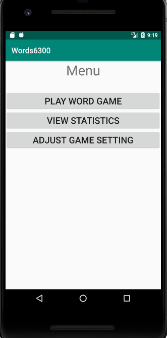

#### View or change game settings:
if the 'game settings' option is chosen from the home screen, the user can updated the game settings for the new game. The player has the options to change the maximum number of turns allowed in the game as shown in the image below. The maximum number of turns must be greater than 0.

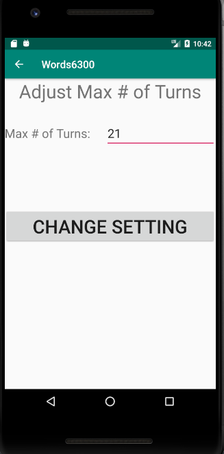  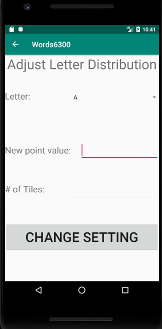

The player can also change the letter settings for the new game. The player can select the letter that he/she wants to update. The player is given the option to adjust the  number of letter points and frequency for each letter available in the pool of letters. The screen images shown below capture all these options. Both letter points and distribution must be greater than 0.

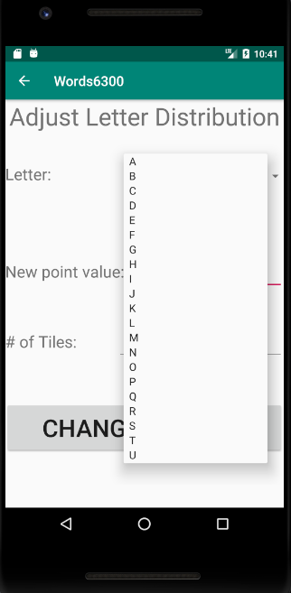  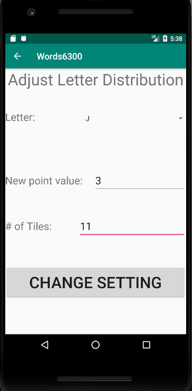

 If the player decides not to make any change to the letter distribution settings, the new game will start with the default 'English Scrabble Distribution' settings.

#### Play a game:
1. Start the Game:
This is the second option that user can select from the home screen. When the game starts, the player is shown a 'board' consisting of 4 letters and a 'rack' consisting of 7 letters as shown in the image. The letters in the 'board' and the 'rack' are randomly drawn from the pool of letters.

2. Play a Word:
In each turn, the player can enter a valid word made up of one letter from the board and one or more letters from the rack. The player must choose the letter that he/she wants to play from the dropdown menu of the board letters (shown in the screen image). The player can not repeat any word twice in a single game.

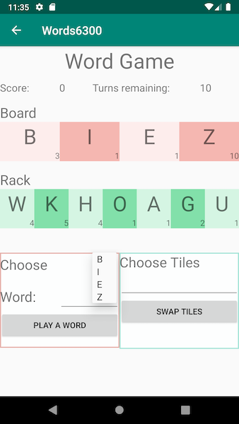 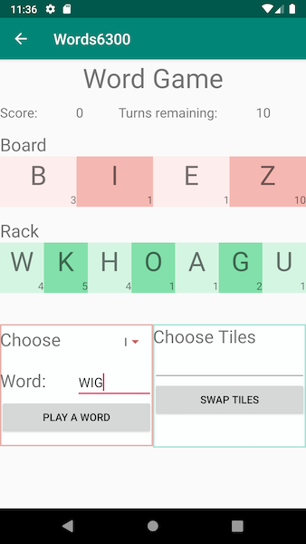

3. Swap Tiles:
As an alternative to playing a word, the player can also swap any number of the seven letters from the rack with letters from the pool. To do so, the player will have to type the letter he/she wants to swap in the text field right above "Swap Tiles" button as shown in the image below. Each swap will cost the player one turn of the game.

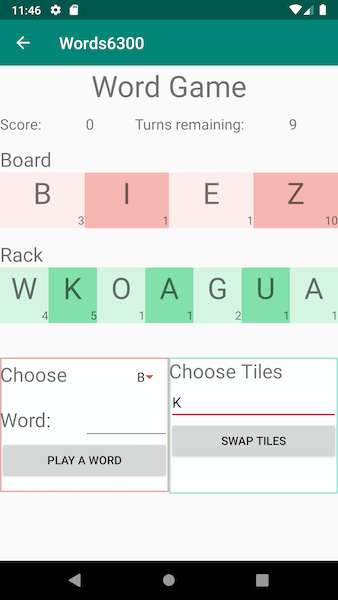

4. Score:
If the player decides to play a word, the letter played from the board is replaced by a different random letter from the word that was just played and the tiles used from the rack are replaced from the pool of letters. At the same time, the player’s score increases by the total number of points for the letters in the word, including the letter used from the board.

5. End of game and bonus points:
If the pool of letters is empty and the rack cannot be refilled, the player scores an additional 10 points. When the maximum number of turns has been played, or the pool of letters is empty and the rack cannot be refilled, the game will end, and the final score will be displayed before returning to the first menu. If the player decides to leave a game in progress, selecting to play game from menu in future would return to that game.

#### View statistics:
The game statistics screen provides three options to a player. All the screens are shown in the images below.
(1) View game score statistics:  A list of scores wil be displayed if selected this option. The scores displayed in descending order by the latest game score displayed first. For each of the scores, the display shows the final game score, the number of turns in that game, and the average score per turn
(2) View letter statistics: If this option is chosen, the player can see the list of letters sorted in ascending order by number of times they were  played. For each of the letters, the player can also see the total number of times that letter has been traded back into the pool and the percentage of times that the letter is used in a word, out of the total number of times it has been drawn
(3) View the word bank: This option shows the player the list of words played in the game starting from the most recently played word. In addition, the screen also shows the number of times a word has been played.

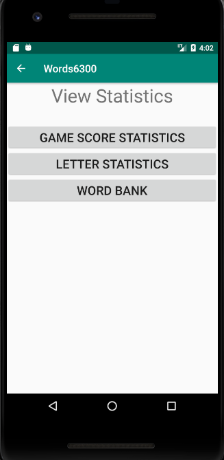  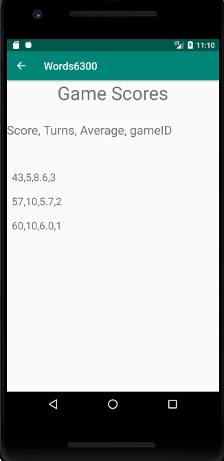
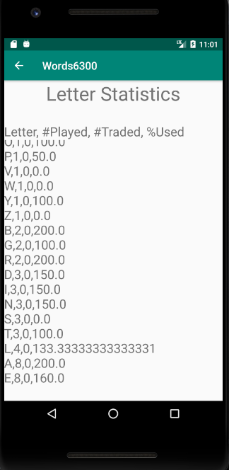  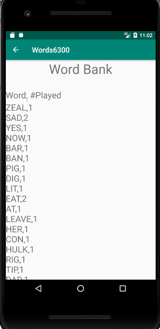

(Note: for the "Letter Statistics", the percentage used (%Used) can be over 100%, because when a user replace a letter with a rack letter and play it again, it counts 2 plays with 1 draw.)
